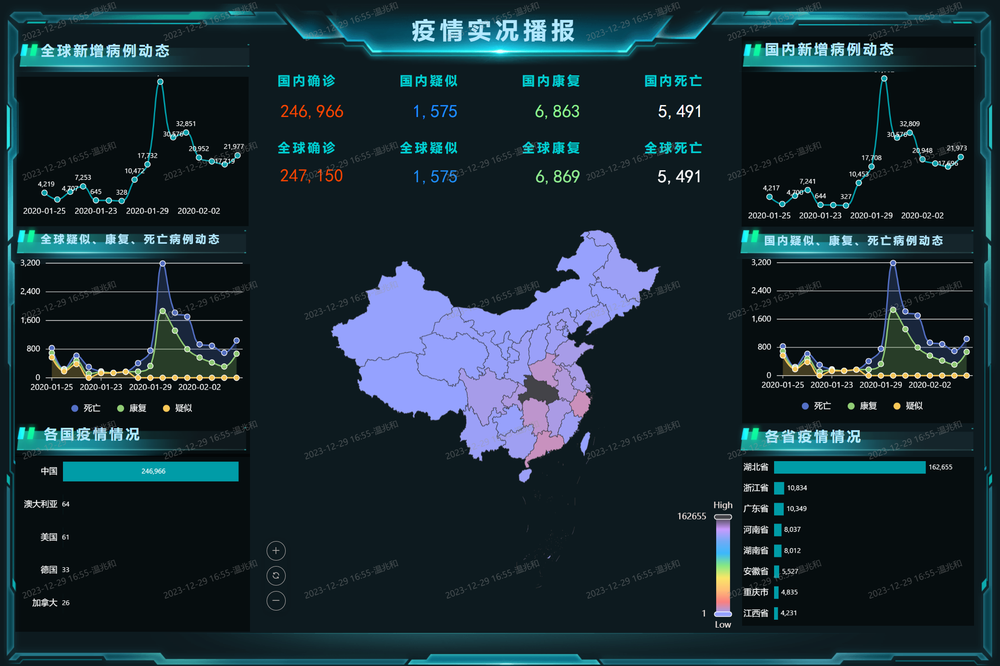
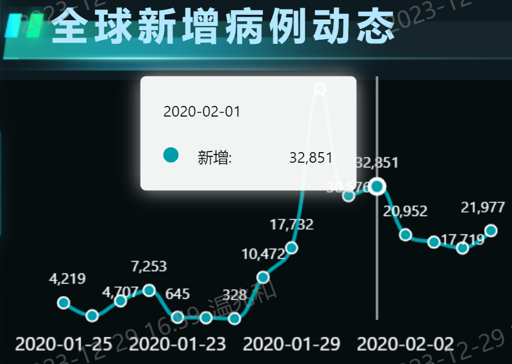
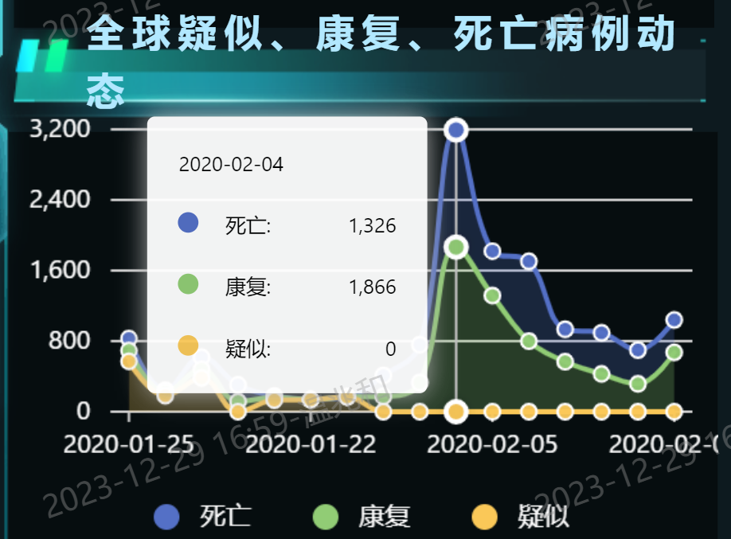
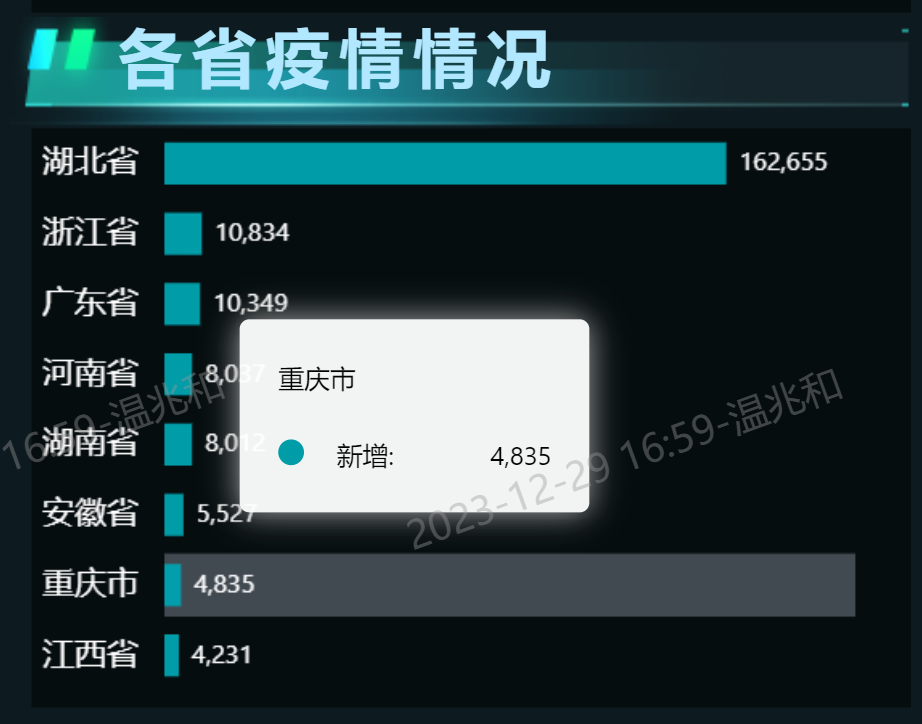
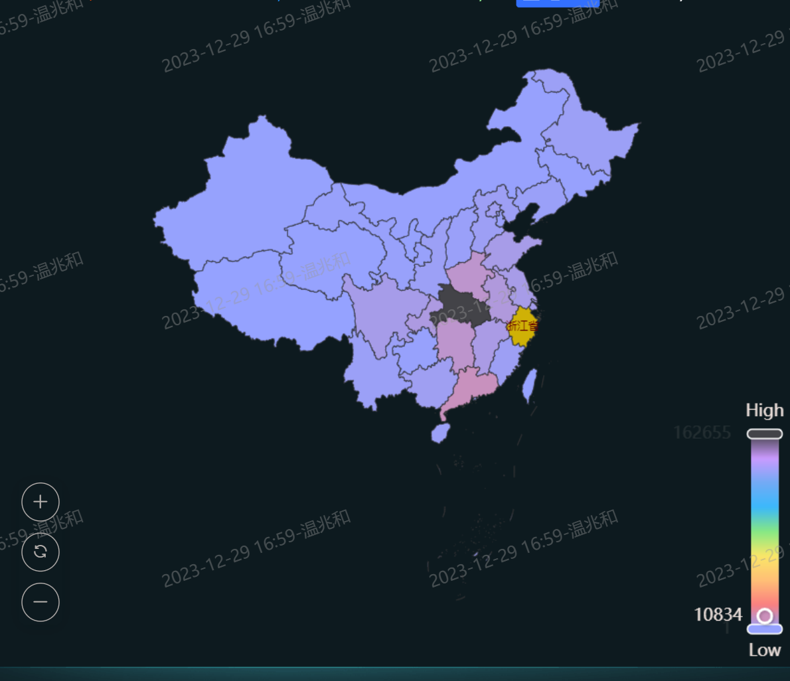
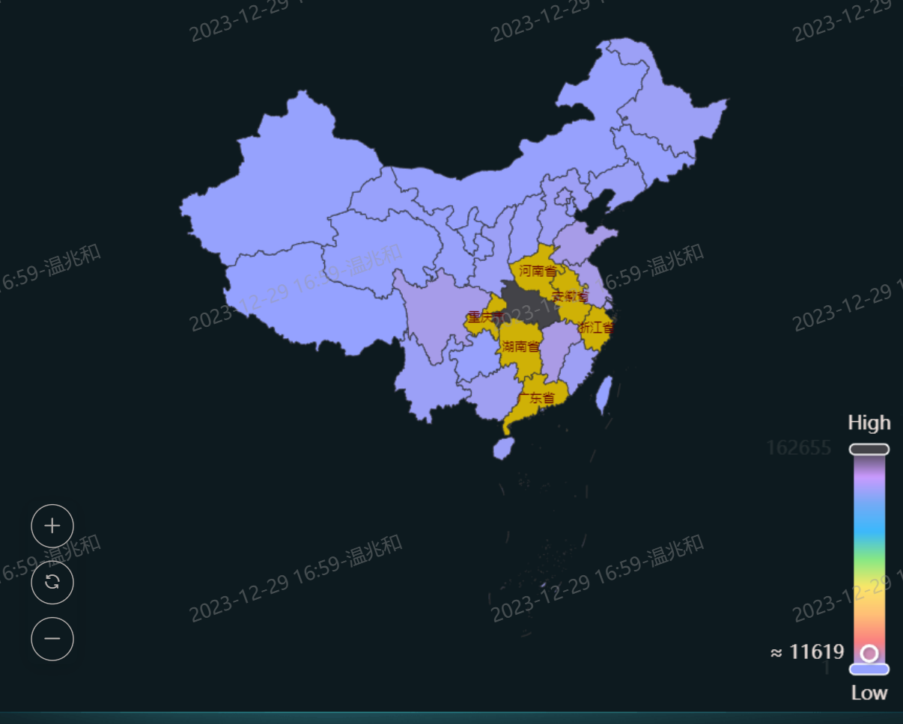

# 云计算系统 期末大项目
温兆和 10205501432

本次项目的内容是基于DataEase环境开发一个数据大屏，它反映了2020年一月底到二月初包括中国在内的一些国家的新冠肺炎感染情况。

## 数据获取与预处理
本项目的数据集来自kaggle的[2019 Coronavirus dataset (January - February 2020)](https://www.kaggle.com/datasets/brendaso/2019-coronavirus-dataset-01212020-01262020)，包含了2020年一月底至二月初包括中国在内的一些国家的一些省份当日新增、疑似、康复和死亡的新冠病例数量。

原始数据集存在数据缺失和数据孤岛现象，所以在完成项目之前需要对原始数据进行预处理。首先在各原始csv文件中统一列名，然后运行`~/dataset/DataPreprocess.ipynb`中的代码，这会删除重复数据、处理数据中的缺失值并统一日期格式，最后将所有数据存入`~/dataset/covid_data.xlsx`。最后，在`~/dataset/covid_data.xlsx`中用Excel的“统一替换”功能将数据集中所有的英文国名和英文中国省名改为中文，这样数据大屏上显示出来的就都是中文了。

**值得注意的是，如果要重新运行`~/dataset/DataPreprocess.ipynb`中的代码，最好首先删除`~/dataset/covid_data.xlsx`。**

## 作品展示
点击[此处](http://student.dataease.fit2cloud.com/#/panel/index)就可以访问本次项目的作品。总体效果如下图所示:



把光标放在折线图和堆叠图上的点上，可以看到相应的日期和数值：





把光标放在柱状图的柱子上，也可以看到相应的地区名和数值：



把光标放在地图上，可以看到相应省份的名称和确诊数量：



把光标放在地图右下方的游标上，可以查看某个数量范围内有哪些省份：



具体效果可见`./display.mp4`。

## 本项目文件路径
```shell
.
│   10205501432_温兆和_云计算系统期末大项目.DET
│   202312 《云计算系统》数据可视化分析实践课V1.0.pdf
│   display.mp4
│   README.md
│
├───.ipynb_checkpoints
│       Untitled-checkpoint.ipynb
│
├───dataset
│   │   2019_nC0v_20200121_20200126 - SUMMARY.csv
│   │   2019_nC0v_20200121_20200126_cleaned.csv
│   │   2019_nCoV_20200121_20200127.csv
│   │   2019_nCoV_20200121_20200128.csv
│   │   2019_nCoV_20200121_20200130.csv
│   │   2019_nCoV_20200121_20200131.csv
│   │   2019_nCoV_20200121_20200201.csv
│   │   2019_nCoV_20200121_20200205.csv
│   │   2019_nCoV_20200121_20200206.csv
│   │   covid_data.xlsx
│   │   DataPreprocess.ipynb
│   │
│   └───.ipynb_checkpoints
└───img
        P1.png
        P2.png
        P3.png
        P4.png
        P5.png
        P6.png
```